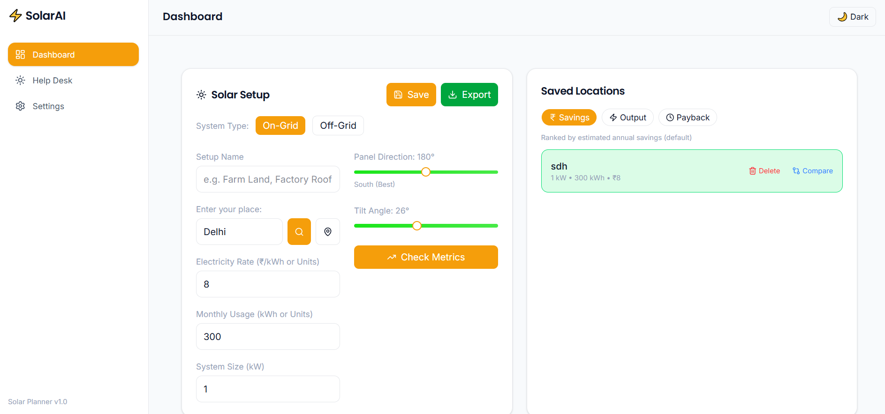

# ⚡ Solar Energy Dashboard

<p align="center">
  A modern, interactive React dashboard to visualize and compare solar energy production with real-time insights and a premium UI.
</p>

---

## 🚀 Live Demo

👉 https://effulgent-pegasus-18f686.netlify.app/

## 📂 Repository

👉 https://github.com/CAPTAjGhost101/SolarPredictionDash

---

## ✨ Overview

This project is a **solar energy monitoring dashboard** designed to simulate a real-world renewable energy system. It enables users to analyze **energy production, compare locations, and visualize data interactively** through a modern and responsive interface.

---

## 🆕 Version

### 🚀 v2.0 (Latest)

- 🗺️ Introduced **map-based layout** for better visualization
- 📍 Enhanced **location comparison functionality**
- 🎛️ Added **interactive buttons and controls**
- ✨ Improved **animations and transitions**
- 🔤 Refined **typography and overall UI polish**

### v1.0

- Basic dashboard with charts
- Initial energy tracking system

---

## 🚀 Features

### 📊 Data Visualization

- Interactive charts using Recharts
- Actual vs Estimated energy comparison
- Tooltip-based data insights

### 🎨 UI / UX

- Clean, minimal, modern interface
- Light & Dark mode support
- Fully responsive (mobile + desktop)
- Smooth animations and transitions

### ⚙️ Functionality

- Dynamic data rendering
- Component-based architecture
- Optimized chart performance
- Conditional rendering (loading states)
- Map-based UI interaction (v2.0)

---

## 🛠 Tech Stack

| Category        | Technology   |
| --------------- | ------------ |
| Frontend        | React.js     |
| Styling         | Tailwind CSS |
| Charts          | Recharts     |
| Build Tool      | Vite         |
| Deployment      | Vercel       |
| Version Control | Git & GitHub |

---

## 📸 Preview

<p align="center">
  
</p>

---

## 🧠 Architecture

```bash
src/
 ├── components/   # Reusable UI components (charts, cards, controls)
 ├── pages/        # Main dashboard layout
 ├── hooks/        # Custom hooks
 ├── utils/        # Helper functions
 ├── assets/       # Images & icons
 └── App.jsx
```

---

## ⚙️ Installation

```bash
git clone https://github.com/yourusername/project-SolarPredictionDash.git
cd project-name
npm install
npm run dev
```

---

## 🌐 Deployment

Deployed using **netlify** with GitHub integration for continuous deployment.

```bash
npm run build
```

---

## 💡 Key Highlights

- Built a **production-ready dashboard with modern UI**
- Implemented **interactive data visualization and comparison logic**
- Designed a **map-integrated interface for better user experience**
- Focused on **scalable architecture and clean code practices**

---

## 📚 Key Learnings

- Building scalable React applications
- Implementing real-world data visualization
- Enhancing UI/UX using Tailwind CSS
- Managing project structure and performance
- Deploying applications using modern workflows

---

## 🔮 Future Improvements

- 🔌 Real-time API integration
- 📊 Advanced analytics & insights
- 🔔 Smart alert system
- 📅 Historical data tracking

---

## 🤝 Contributing

Contributions are welcome! Feel free to fork and submit a pull request.

---

## 📄 License

MIT License © 2026

---

<p align="center">
  Made with ⚡ using React, Tailwind & modern web practices
</p>
